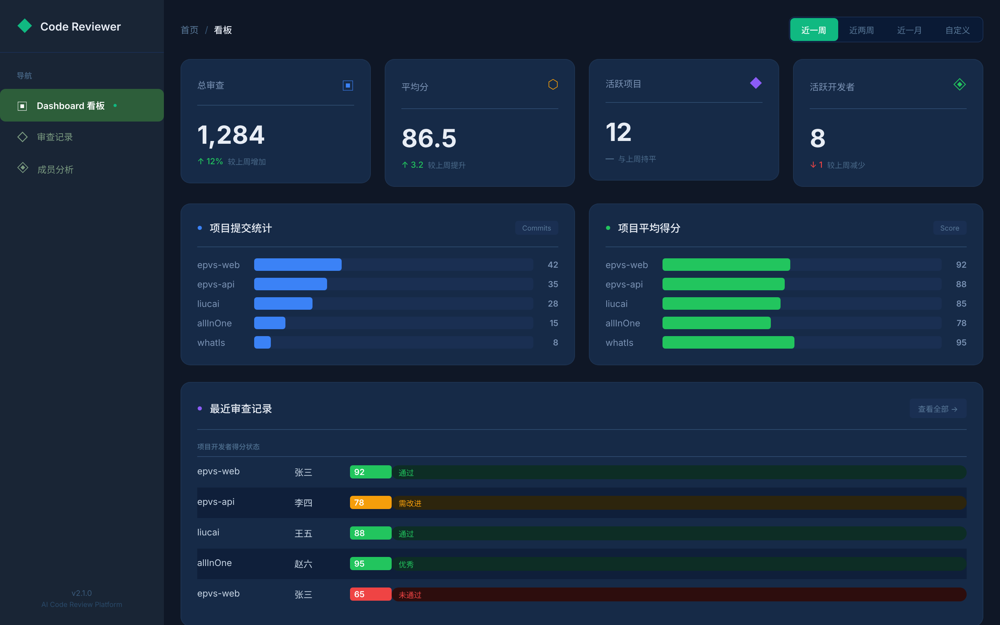
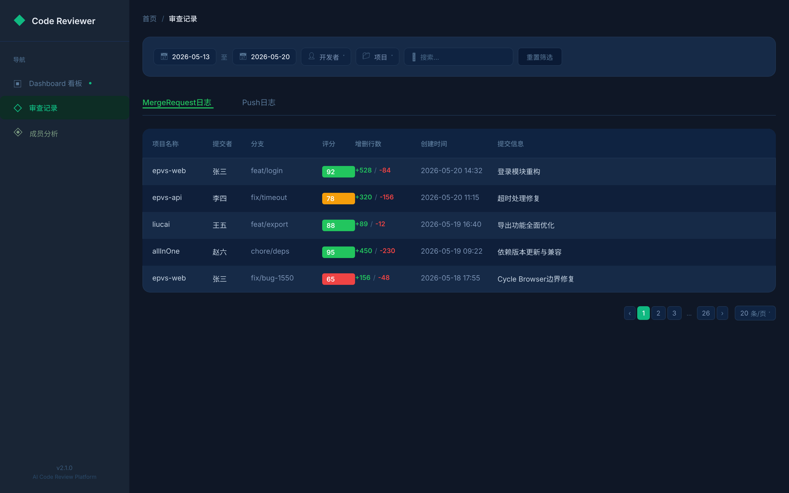
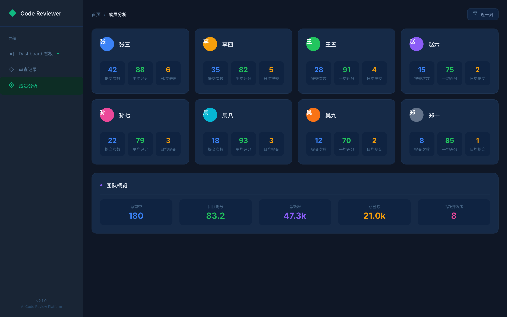

# Code Review Agent

> AI-powered automated code review tool. Integrates with GitLab / GitHub webhooks, supports multiple LLM providers, and delivers review results to Feishu / DingTalk / WeCom.

> **⚠️ Fork notice:** This project is a fork of [AI-Codereview-Gitlab](https://github.com/sunmh207/AI-Codereview-Gitlab) (Apache-2.0) by [sunmh207](https://github.com/sunmh207). We've added GitHub webhook support, feishu-relay for private DM delivery, per-project prompt routing, and various enhancements. See the [Acknowledgments](#acknowledgments) section for details.

[](LICENSE)
[](https://github.com/phoenine/code-reviewer/actions/workflows/build.yml)

---

## Table of Contents

- [Features](#features)
- [Architecture](#architecture)
- [Screenshots](#screenshots)
- [Quick Start (Docker)](#quick-start-docker)
- [Manual Setup](#manual-setup)
- [Configuration](#configuration)
- [Webhook Setup](#webhook-setup)
  - [GitLab](#gitlab)
  - [GitHub](#github)
- [Notification Channels](#notification-channels)
- [Review Styles](#review-styles)
- [Feishu Relay (Optional)](#feishu-relay-optional)
- [Development](#development)
- [License](#license)
- [Acknowledgments](#acknowledgments)

---

## Features

- **Multi-LLM Support** — DeepSeek, OpenAI, Anthropic Claude, Qwen, ZhipuAI, Ollama (bring your own key)
- **Platform Integration** — GitLab & GitHub webhook (Merge Request / Push)
- **Instant Notifications** — Results delivered to Feishu, DingTalk, WeCom, or custom webhook
- **Rich Dashboard** — Review history, project statistics, developer analytics
- **Review Styles** — Professional, Sarcastic, Gentle, Humorous (yes, it roasts your code if you want)
- **Reusable Prompt Routing** — Per-project review rules for domain-specific checks
- **Docker Ready** — One-command deployment via docker compose

---

## Architecture

```
┌──────────────┐     Webhook      ┌──────────────────┐
│  GitLab /     │ ──────────────► │  code-reviewer    │
│  GitHub       │                 │  (Flask + Vue)    │
│               │ ◄────────────── │  :25001           │
│               │  Review notes   └────────┬─────────┘
│               │                          │
└──────────────┘                          │ EXTRA_WEBHOOK (optional)
                                          ▼
                                   ┌──────────────┐
                                   │ feishu-relay  │
                                   │ (FastAPI)     │
                                   │ :8090         │
                                   └──────┬───────┘
                                          │
                                          ▼
                                   ┌──────────────┐
                                   │   Feishu IM   │
                                   │  (private DM) │
                                   └──────────────┘
```

When a developer pushes code or creates a merge request, the platform triggers a webhook to **code-reviewer**. The service invokes an LLM to review the diff, posts the result back as a note/comment on the MR/commit, and optionally forwards the notification to **feishu-relay** for private Feishu DM delivery.

---

## Screenshots

| Dashboard | Review Detail | Member Analysis |
|-----------|---------------|-----------------|
|  |  |  |

---

## Quick Start (Docker)

**Prerequisites:** Docker & Docker Compose

```bash
# 1. Clone
git clone https://github.com/phoenine/code-reviewer.git
cd code-reviewer

# 2. Configure environment
cp conf/.env.dist conf/.env
# Edit conf/.env — set LLM_PROVIDER, API keys, GITLAB_ACCESS_TOKEN, etc.

# (Optional) feishu-relay
cp feishu-relay/.env.example feishu-relay/.env
cp feishu-relay/config/git_user_to_name.json.example feishu-relay/config/git_user_to_name.json
cp feishu-relay/config/feishu_open_ids.json.example feishu-relay/config/feishu_open_ids.json

# 3. Start both services
docker compose -f deployment/docker-compose.yml up -d --build
```

**Verify:**
- API: `http://<your-server-ip>:25001` — shows "The code review server is running."
- Dashboard: `http://<your-server-ip>:25001`
- Feishu Relay health: `http://<your-server-ip>:8090/health`

---

## Manual Setup

**Prerequisites:** Python 3.10+, Node.js 18+

```bash
# 1. Clone
git clone https://github.com/phoenine/code-reviewer.git
cd code-reviewer

# 2. Python backend
python -m venv .venv
source .venv/bin/activate
pip install -r requirements.txt

# 3. Configure
cp conf/.env.dist conf/.env
# Edit conf/.env with your API keys

# 4. Start API
python api.py                        # Flask on :5001

# 5. (Another terminal) Frontend
cd frontend
npm install
npm run dev                          # Vite dev server on :5173
```

The Vite dev server proxies `/api/*` to `http://127.0.0.1:5001`.

---

## Configuration

All configuration lives in `conf/.env`. Copy from the template:

```bash
cp conf/.env.dist conf/.env
```

Key settings:

| Variable | Description | Example |
|----------|-------------|---------|
| `LLM_PROVIDER` | LLM backend | `deepseek`, `openai`, `anthropic`, `qwen`, `zhipuai`, `ollama` |
| `DEEPSEEK_API_KEY` | Your API key | `sk-...` |
| `OPENAI_API_KEY` | Your API key | `sk-...` |
| `GITLAB_ACCESS_TOKEN` | GitLab personal/project access token | `glpat-...` |
| `GITHUB_ACCESS_TOKEN` | GitHub personal access token | `ghp_...` |
| `SUPPORTED_EXTENSIONS` | File extensions to review | `.java,.py,.ts,.js` |
| `REVIEW_STYLE` | Review personality | `professional`, `sarcastic`, `gentle`, `humorous` |
| `DINGTALK_WEBHOOK_URL` | DingTalk robot webhook | `https://oapi.dingtalk.com/robot/send?access_token=...` |
| `WECOM_WEBHOOK_URL` | WeCom robot webhook | `https://qyapi.weixin.qq.com/cgi-bin/webhook/send?key=...` |
| `FEISHU_WEBHOOK_URL` | Feishu bot webhook | `https://open.feishu.cn/open-apis/bot/v2/hook/...` |
| `EXTRA_WEBHOOK_URL` | Custom callback (e.g. feishu-relay) | `http://feishu-relay:8090/notify` |

See `conf/.env.dist` for the full list.

---

## Webhook Setup

### GitLab

1. **Create an access token** — In GitLab: Settings → Access Tokens → create a token with `api` scope. Set it as `GITLAB_ACCESS_TOKEN` in `.env`.

2. **Configure the webhook** — In your GitLab project: Settings → Webhooks:

   | Field | Value |
   |-------|-------|
   | URL | `http://your-server-ip:25001/review/webhook` |
   | Secret Token | (optional) — set as `GITLAB_WEBHOOK_SECRET` in `.env` |
   | Trigger | **Push events** & **Merge request events** only |

### GitHub

1. **Create a personal access token** — GitHub: Settings → Developer settings → Personal access tokens → `Fine-grained tokens` with `Contents: read` and `Pull requests: read & write`. Set as `GITHUB_ACCESS_TOKEN` in `.env`.

2. **Configure the webhook** — In your GitHub repository: Settings → Webhooks → Add webhook:

   | Field | Value |
   |-------|-------|
   | Payload URL | `http://your-server-ip:25001/review/webhook` |
   | Content type | `application/json` |
   | Secret | (optional) — set as `GITHUB_WEBHOOK_SECRET` in `.env` |
   | Events | **Pull requests** & **Pushes** |

> **Note:** Only `push` and `pull_request` / `merge_request` events are supported.

---

## Notification Channels

Configure in `conf/.env`:

| Channel | Enable | Required Config |
|---------|--------|-----------------|
| **DingTalk** | `DINGTALK_ENABLED=1` | `DINGTALK_WEBHOOK_URL` |
| **WeCom** | `WECOM_ENABLED=1` | `WECOM_WEBHOOK_URL` |
| **Feishu** | `FEISHU_ENABLED=1` | `FEISHU_WEBHOOK_URL` |
| **Custom Webhook** | `EXTRA_WEBHOOK_ENABLED=1` | `EXTRA_WEBHOOK_URL` |

When using Docker, the internal `feishu-relay` service is available at `http://feishu-relay:8090/notify`.

---

## Review Styles

Set `REVIEW_STYLE` in `.env`:

| Style | Description |
|-------|-------------|
| `professional` 🎩 | Formal, thorough, detail-oriented |
| `sarcastic` 😈 | Sharp and brutally honest ("Did you write this with your eyes closed?") |
| `gentle` 🌸 | Soft suggestions, encouraging tone ("Perhaps we could optimize this a bit~") |
| `humorous` 🤪 | Funny comments that make fixing bugs less painful |

---

## Feishu Relay (Optional)

**feishu-relay** is a companion service that forwards review notifications to individual Feishu users via private messages.

It maps Git usernames → Chinese names → Feishu Open IDs, then sends the review result as a Feishu interactive card directly to the committer's DM.

### Configuration

```bash
cp feishu-relay/.env.example feishu-relay/.env
# Edit FESIHU_APP_ID, FEISHU_APP_SECRET

cp feishu-relay/config/git_user_to_name.json.example feishu-relay/config/git_user_to_name.json
cp feishu-relay/config/feishu_open_ids.json.example feishu-relay/config/feishu_open_ids.json
# Edit the JSON mapping files with your team's info
```

Then in `conf/.env` of the main code-reviewer, point the extra webhook to the relay:

```
EXTRA_WEBHOOK_ENABLED=1
EXTRA_WEBHOOK_URL=http://feishu-relay:8090/notify
```

In Docker, this is pre-configured via the compose environment variable.

---

## Development

### Backend

```bash
source .venv/bin/activate
python api.py        # Flask on :5001
```

### Frontend

```bash
cd frontend
npm install
npm run dev          # Vite on :5173, proxies /api/* to :5001
npm run build        # Production build
```

### Project Structure

```
code-reviewer/
├── api.py                    # Flask entry point
├── biz/                      # Core business logic
│   ├── api/routes/           # Flask routes (dashboard, webhook, home)
│   ├── llm/                  # LLM provider clients (DeepSeek, OpenAI, ...)
│   ├── platforms/            # GitLab / GitHub webhook handlers
│   ├── service/              # Review service
│   └── utils/                # Notifiers, parser, queue, logger
├── conf/                     # Configuration templates
├── deployment/               # Docker & CI
│   ├── docker-compose.yml    # Both services
│   └── Dockerfile            # code-reviewer image
├── feishu-relay/             # Optional Feishu DM relay
│   ├── app/main.py           # FastAPI app
│   └── config/               # User mapping files
├── frontend/                 # React + Vite dashboard
└── .github/workflows/        # CI
```

---

## License

This project is licensed under the Apache License 2.0 — see the [LICENSE](LICENSE) file for details.

---

## Acknowledgments

- Based on [AI-Codereview-Gitlab](https://github.com/sunmh207/AI-Codereview-Gitlab) by sunmh207 (Apache-2.0)
- Built with [Flask](https://flask.palletsprojects.com/), [FastAPI](https://fastapi.tiangolo.com/), [React](https://react.dev/), [Vite](https://vitejs.dev/)
- UI components from [Highcharts](https://www.highcharts.com/) & [DevExtreme](https://js.devexpress.com/)
